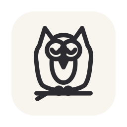

<p align="center">
  
</p>

<h1 align="center">Owlet</h1>

A tiny native macOS menu-bar app that keeps your Mac awake — including with the lid closed (clamshell mode). No Dock icon, no windows, just an owl in your menu bar.

Owlet uses IOKit power assertions to block idle sleep (like the classic "caffeine" apps) and, when you ask for it, flips the system-wide `disablesleep` setting so the machine keeps running with the lid shut.

- Menu-bar only (`LSUIElement`) — no Dock icon, no main window
- Keep the system and display awake via IOKit power assertions
- Optional **Allow Display to Sleep** mode — keep the system awake while letting the screen turn off
- Optional lid-closed (clamshell) mode via `pmset disablesleep` (asks for admin)
- Auto-release timers for both keep-awake and clamshell
- **Battery-aware clamshell** — warns before enabling on battery and automatically reverts if you unplug from AC
- **Notifications** when a keep-awake timer ends or clamshell auto-reverts
- Optional **privileged helper** for unattended, password-free clamshell reverts (signed builds)
- **Automatic updates** via Sparkle — checks a signed appcast and installs new versions in place
- Custom owl glyph drawn in code: filled when active, outline when idle
- Launch at login (SMAppService)
- Warns and offers to reset clamshell if it was left on from a previous session
- Cleans up all assertions and resets `disablesleep` on quit

## Download

Grab the latest `Owlet-<version>-universal.dmg` from the [Owlet releases page](https://github.com/LushBinary/Owlet/releases). It's a **universal** build that runs on both Apple Silicon and Intel Macs — no need to pick an architecture.

Open the DMG and drag **Owlet.app** into your Applications folder, then launch it — the owl appears in your menu bar. If macOS says the app is damaged, it's an unsigned build being blocked by Gatekeeper; see [Running an unsigned (ad-hoc) build](#running-an-unsigned-ad-hoc-build).

## Requirements

- macOS 13 (Ventura) or later
- Xcode 16.1 or later (the project uses the `objectVersion 77` project format and a Swift Package dependency; developed against Xcode 26)
- An admin account (clamshell mode needs root to change `disablesleep`)

## Who needs an Apple Developer account?

The dividing line is **using** Owlet versus **distributing signed releases** of it —
not "DMG versus source."

| You are…                                                          | Paid Apple Developer account?                                                                                                                                                      |
| ----------------------------------------------------------------- | ---------------------------------------------------------------------------------------------------------------------------------------------------------------------------------- |
| **Downloading and running a DMG**                                 | **No.** Never needed. If the DMG is signed + notarized it opens cleanly; if it's unsigned you just approve it once via right-click → Open or System Settings > Privacy & Security. |
| **Building & running the source on your own Mac**                 | **No.** Ad-hoc signing (`CODE_SIGNING_ALLOWED=NO`) or a free Apple ID ("Sign to Run Locally") both build and launch the app.                                                       |
| **Publishing Developer ID-signed, notarized releases for others** | **Yes** ($99/year). Required for a notarized DMG, for the privileged helper to register via `SMAppService`, and for Sparkle updates to install past Gatekeeper.                    |

Two features are **signing-gated**: the unattended **privileged helper** and
**Sparkle auto-update**. On an unsigned/local build the app still runs — the helper
falls back to the admin-password prompt and auto-update stays inert — they only work
for end users when you ship signed, notarized builds. The Sparkle EdDSA signing key
is separate from Apple and is **free** in every case.

### Running an unsigned (ad-hoc) build

Builds without a Developer ID (the default CI output and local ad-hoc builds) are
**ad-hoc signed but not notarized**. macOS adds a quarantine flag to anything you
download, so double-clicking such a DMG's app can report:

> "Owlet" is damaged and can't be opened. You should move it to the Trash.

It isn't damaged — that's Gatekeeper refusing an un-notarized, quarantined app. To
run it, remove the quarantine attribute after copying the app to Applications:

```bash
xattr -dr com.apple.quarantine /Applications/Owlet.app
```

Then open Owlet normally. (Building and running from Xcode on your own Mac never
hits this, since local builds aren't quarantined.) The only way to remove this step
for other users is a Developer ID-signed, notarized release — see below.

## Install / Build

### Open in Xcode

1. Open `Owlet.xcodeproj`.
2. Select the **Owlet** scheme.
3. Build and Run (`Cmd-R`). The owl appears in your menu bar; there is no Dock icon or window.

### Command line

```bash
# Debug build
xcodebuild -project Owlet.xcodeproj -scheme Owlet -configuration Debug \
  -destination 'generic/platform=macOS' build

# Release build into ./build, then launch
xcodebuild -project Owlet.xcodeproj -scheme Owlet -configuration Release \
  -derivedDataPath ./build build
open ./build/Build/Products/Release/Owlet.app
```

## Usage

Click the owl in the menu bar to open the menu:

- **Keep Awake** — hold power assertions so the Mac and display don't idle-sleep. Fully reversible; changes no system settings.
- **Keep Awake For…** — 30 min / 1 hr / 2 hr / Indefinitely. Auto-releases when the timer ends.
- **Allow Display to Sleep** — when checked, Keep Awake holds only the system assertion so the display can still turn off (handy for downloads/renders). Takes effect immediately, even mid-session.
- **Allow Lid-Closed (Clamshell) Mode** — runs `pmset -a disablesleep 1` (prompts for your admin password) so the Mac keeps running with the lid closed. If you're on battery, Owlet warns first; if you later unplug from AC, it turns clamshell off automatically.
- **Keep Clamshell For…** — 1 hr / 2 hr / 4 hr / Indefinitely. Enables clamshell and schedules an automatic revert.
- **Launch at Login** — start Owlet automatically when you log in.
- **Unattended Auto-Revert (Helper)** — installs a small background helper so timed and on-battery clamshell reverts happen without an admin prompt, even when you're away. Requires a signed build and a one-time approval under Login Items.
- **What do these do?** — an in-app panel explaining every feature and its risks. Each menu item also has a hover tooltip.
- **Check for Updates…** — ask Sparkle to look for a newer version and install it. Owlet also checks automatically about once a day.
- **Quit Owlet** — releases every assertion and resets `disablesleep` to `0` before exiting.

You'll also get a notification banner when a Keep Awake timer finishes or when clamshell auto-reverts (on timer expiry or after unplugging), so you always know when Owlet has stopped keeping the Mac awake.

The menu bar icon is **filled** when Keep Awake or Clamshell is active and an **outline** when idle. On launch, Owlet reads the real `SleepDisabled` state from `pmset -g` so the UI matches the actual system state.

## How it works

- **Keep awake** uses `IOPMAssertionCreateWithName` with `kIOPMAssertionTypePreventUserIdleSystemSleep` and (unless _Allow Display to Sleep_ is on) `kIOPMAssertionTypePreventUserIdleDisplaySleep`. These are userland, per-process assertions; releasing them (or quitting) immediately restores normal sleep. The display assertion is created or released on the fly when you toggle _Allow Display to Sleep_, even mid-session.
- **Clamshell** sets the hidden `SleepDisabled` power setting via `pmset -a disablesleep 1`. This needs root, so Owlet either routes it through the privileged helper (silent) or, when no helper is installed, `osascript … with administrator privileges`, which shows the standard macOS auth dialog. A cancelled prompt is detected and leaves state unchanged.
- **Battery awareness** uses IOKit power-source APIs (`IOPSCopyPowerSourcesInfo`, `IOPSGetProvidingPowerSourceType`) plus an `IOPSNotificationCreateRunLoopSource` callback. Owlet warns before enabling clamshell on battery and automatically reverts clamshell if the Mac switches off AC power.
- **Privileged helper** is a small `launchd` daemon (the `OwletHelper` target) registered with `SMAppService`. Owlet talks to it over XPC (`OwletHelperProtocol`) so timed and on-battery reverts can run `pmset` as root with no password prompt. When the helper isn't installed (or the build isn't signed), Owlet transparently falls back to the `osascript` admin-prompt path.
- **Notifications** use `UNUserNotificationCenter` to post a banner when a keep-awake timer ends or clamshell auto-reverts.
- **Auto-update** uses [Sparkle](https://sparkle-project.org): `Updater.swift` hosts an `SPUStandardUpdaterController` that reads the appcast at `SUFeedURL`, verifies each update's EdDSA signature against `SUPublicEDKey`, and installs it in place. See [Auto-update (Sparkle)](#auto-update-sparkle) for setup.
- **State sync** parses `pmset -g` (no privileges needed) so the menu reflects reality on launch and after each change.

## Permissions & security

- **Not sandboxed.** Owlet launches `/usr/bin/pmset` and `/usr/bin/osascript`, which the App Sandbox blocks. `ENABLE_APP_SANDBOX` is therefore `NO`. This means Owlet is **not** eligible for the Mac App Store and must be distributed directly (Developer ID).
- **Admin prompt.** Without the privileged helper, enabling/reverting clamshell mode requires your admin password each time (the auth dialog itself is the privilege gate). No password is ever stored.
- **Privileged helper.** The optional `OwletHelper` daemon runs as root to flip `disablesleep` without a prompt. `SMAppService` only loads it from a Developer ID-signed app, so on unsigned/ad-hoc builds registration fails and Owlet falls back to the prompt. The helper exposes a single XPC method; a signed build should also pin the client's code requirement via `NSXPCConnection.setCodeSigningRequirement(_:)`.
- **Notifications.** Owlet requests notification permission on first launch to tell you when a timer ends or clamshell auto-reverts.
- **Auto-update.** Update archives are verified with Sparkle's EdDSA signature (independent of Apple), but the delivered app still needs Developer ID signing + notarization to clear Gatekeeper on other Macs. The Sparkle private key must be kept secret; only the public key ships in the app.
- **Hardened runtime** is enabled (`ENABLE_HARDENED_RUNTIME = YES`) so the app can be notarized.

## Important notes & limitations

- **Clamshell is system-wide.** `disablesleep` isn't scoped to Owlet — while it's on, _nothing_ sleeps the Mac. Owlet resets it on a clean quit, but a force-quit or kernel panic can leave it stuck on. Owlet detects this on next launch and offers to reset it.
- **Heat/airflow.** With the lid shut the Mac loses its main airflow path and can run hot under load. Keep it on AC power and, ideally, on a hard surface.
- **Clamshell macOS rules.** Lid-closed operation is most reliable on AC power, and some Mac models still expect an external display attached.
- **Auto-revert needs admin (without the helper).** When the clamshell timer fires or the Mac drops to battery, reverting needs root. If the **Unattended Auto-Revert (Helper)** is installed (signed builds only), the revert is silent. Otherwise macOS shows a password prompt, and on an unattended Mac clamshell stays on until someone confirms.
- **Launch at Login approval.** macOS may ask you to approve Owlet once under System Settings > General > Login Items. For `register()` to stick on other machines, the app must be signed.

## Distribution: code signing & notarization

To share Owlet outside your own machine:

```bash
# 1. Sign with a Developer ID Application certificate, hardened runtime on
codesign --deep --force --options runtime \
  --sign "Developer ID Application: Your Name (TEAMID)" Owlet.app

# 2. Notarize (zip or a signed DMG), then staple the ticket
xcrun notarytool submit Owlet.zip --apple-id you@example.com \
  --team-id TEAMID --password <app-specific-password> --wait
xcrun stapler staple Owlet.app
```

Notes:

- Keep the app non-sandboxed and Developer-ID signed (not App Store), because it runs privileged shell commands.
- No special entitlements are needed for the IOKit assertions or the `osascript` admin prompt.
- Unsigned/unnotarized builds run fine locally, but Gatekeeper will warn other users.

## Auto-update (Sparkle)

Owlet uses [Sparkle](https://sparkle-project.org) for in-app updates. There is
**no backend or database** — Sparkle is fully static: it reads an _appcast_ (an
XML file) that lists versions and points at DMGs, both hosted on GitHub Releases.

**One-time setup:**

1. **Generate an EdDSA key pair** with Sparkle's `generate_keys` tool. It ships
   inside the resolved Sparkle package; locate and run it with:

   ```bash
   # resolve packages first if you haven't opened the project yet:
   # xcodebuild -project Owlet.xcodeproj -resolvePackageDependencies
   GEN="$(find ~/Library/Developer/Xcode/DerivedData -name generate_keys -path '*Sparkle*' 2>/dev/null | head -1)"
   "$GEN"
   ```

   Approve the keychain prompt. This stores the **private** key in your login
   keychain and prints the **public** key (safe to commit). To export the private
   key for backup / the CI secret, write it to a file with `"$GEN" -x sparkle_private_key.txt`
   (the file is the base64 private seed — treat it like a password and delete it
   after storing it safely).

2. **Paste the public key** into `Owlet/Info.plist` under `SUPublicEDKey`
   (replace the `REPLACE_WITH_YOUR_SPARKLE_ED25519_PUBLIC_KEY` placeholder).

3. **Confirm `SUFeedURL`** in `Owlet/Info.plist`. It defaults to the stable
   "latest release" URL, so it always points at the newest published feed:

   ```
   https://github.com/LushBinary/Owlet/releases/latest/download/appcast.xml
   ```

The private key never ships in the app — only the public key does. Keep it secret;
losing it means you can't sign future updates that existing users will accept.

## Continuous delivery, signing & notarization

The **Build DMG** GitHub Actions workflow (`.github/workflows/release-dmg.yml`)
builds a single **universal** (arm64 + x86_64) disk image per run:

- `Owlet-<version>-universal.dmg`

(A universal binary is used rather than one DMG per architecture, because a
Sparkle appcast can't contain two archives with the same bundle version.)

Its behavior depends on what triggered it:

- **Push to `main` / manual run** — builds an **ad-hoc signed** DMG and uploads it
  as a workflow-run artifact. No secrets needed; Gatekeeper still blocks the
  download (see [Running an unsigned build](#running-an-unsigned-ad-hoc-build)).
- **Push a version tag (`vX.Y.Z`)** — builds a **Developer ID-signed** DMG, notarizes
  and staples it, generates a **Sparkle-signed appcast**, and publishes the DMG
  and `appcast.xml` to a GitHub Release:

  ```bash
  git tag v1.1.0
  git push origin v1.1.0
  ```

This tagged path is what makes both the **privileged helper** (`SMAppService`
requires a signed app) and **Sparkle** (Gatekeeper requires notarization) work for
end users. It needs these **repository secrets**:

| Secret                          | What it is                                       |
| ------------------------------- | ------------------------------------------------ |
| `DEVELOPER_ID_APPLICATION_CERT` | base64 of your _Developer ID Application_ `.p12` |
| `DEVELOPER_ID_CERT_PASSWORD`    | password for that `.p12`                         |
| `APPLE_TEAM_ID`                 | your 10-character Apple Developer Team ID        |
| `APPLE_ID`                      | Apple ID email used for notarization             |
| `APPLE_APP_SPECIFIC_PASSWORD`   | app-specific password for that Apple ID          |
| `SPARKLE_PRIVATE_KEY`           | base64 EdDSA private key from `generate_keys -x` |

All of the Apple secrets require a **paid Apple Developer Program** membership
(Developer ID certificates and notarization are gated behind it). `SPARKLE_PRIVATE_KEY`
is generated by Sparkle and needs no Apple account.

You can also build a DMG locally with the same script:

```bash
xcodebuild -project Owlet.xcodeproj -scheme Owlet -configuration Release \
  -derivedDataPath build build
scripts/make-dmg.sh build/Build/Products/Release/Owlet.app \
  dist/Owlet-1.0.dmg "Owlet 1.0"
```

> **Why universal, not per-architecture?** Sparkle's `generate_appcast` rejects an
> appcast that contains two archives with the same bundle version (which two
> same-version per-arch DMGs would be). A single universal binary sidesteps that
> and keeps one download for everyone — and Owlet's binaries are tiny, so the size
> cost is negligible.

## Releasing a new version

1. **Bump the version.** In Xcode (target **Owlet** → _General_) or in
   `project.pbxproj`, raise **both**:
   - `MARKETING_VERSION` — the human-readable version (e.g. `1.1`), shown to users.
   - `CURRENT_PROJECT_VERSION` — the machine-readable build number Sparkle compares
     (`CFBundleVersion`); it must strictly increase every release.

   If you don't bump these, Sparkle will not detect the release as an update.

2. **Commit** the version bump and `Owlet.xcodeproj/project.xcworkspace/xcshareddata/swiftpm/Package.resolved`
   (it pins the exact Sparkle version so CI resolves the same build).

3. **Tag and push:**

   ```bash
   git tag v1.1.0
   git push origin v1.1.0
   ```

4. CI signs, notarizes, staples, generates the signed `appcast.xml`, and publishes
   everything to the GitHub Release. Existing users are then offered the update
   automatically (or via **Check for Updates…**).

Prerequisites for this to work end-to-end (see the sections above): a paid Apple
Developer account with a Developer ID Application certificate, the six repository
secrets configured, and your real Sparkle public key in `SUPublicEDKey`.

## Project structure

```
Owlet/
├── Owlet/                          # the app target
│   ├── OwletApp.swift              # @main entry — no window; hosts the AppDelegate
│   ├── AppDelegate.swift           # accessory policy; sleep/quit cleanup; starts Notifier
│   ├── StatusBarController.swift   # NSStatusItem, menu, status text, help
│   ├── PowerManager.swift          # IOKit assertions, pmset calls, timers, battery awareness, state
│   ├── PrivilegedHelper.swift      # SMAppService registration + XPC client for the helper
│   ├── Updater.swift               # Sparkle updater wrapper ("Check for Updates…")
│   ├── Notifier.swift              # UNUserNotificationCenter banners
│   ├── OwletSymbol.swift           # the owl menu-bar glyph, drawn in code
│   ├── LoginItem.swift             # SMAppService launch-at-login wrapper
│   ├── Info.plist                  # LSUIElement agent config
│   └── Assets.xcassets/
├── OwletHelper/                    # the privileged helper target (root launchd daemon)
│   ├── main.swift                  # NSXPCListener bootstrap
│   ├── HelperService.swift         # runs `pmset` as root
│   ├── OwletHelperProtocol.swift   # shared XPC contract (compiled into both targets)
│   └── com.lushbinary.Owlet.Helper.plist   # LaunchDaemon plist, embedded in the app bundle
└── Owlet.xcodeproj/
```

## License

[MIT](LICENSE) © 2026 LushBinary
