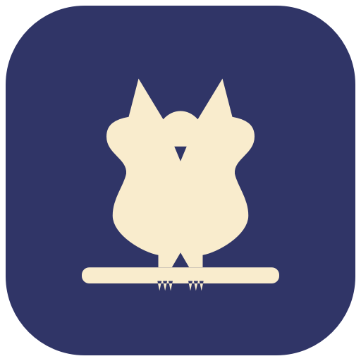

<p align="center">
  
</p>

<h1 align="center">Owlet</h1>

A tiny native macOS menu-bar app that keeps your Mac awake — including with the lid closed (clamshell mode). No Dock icon, no windows, just an owl in your menu bar.

Owlet uses IOKit power assertions to block idle sleep (like the classic "caffeine" apps) and, when you ask for it, flips the system-wide `disablesleep` setting so the machine keeps running with the lid shut.

- Menu-bar only (`LSUIElement`) — no Dock icon, no main window
- Keep the system and display awake via IOKit power assertions
- Optional lid-closed (clamshell) mode via `pmset disablesleep` (asks for admin)
- Auto-release timers for both keep-awake and clamshell
- Custom owl glyph drawn in code: filled when active, outline when idle
- Launch at login (SMAppService)
- Warns and offers to reset clamshell if it was left on from a previous session
- Cleans up all assertions and resets `disablesleep` on quit

## Requirements

- macOS 13 (Ventura) or later
- Xcode 15 or later (developed against Xcode 26)
- An admin account (clamshell mode needs root to change `disablesleep`)

## Install / Build

### Open in Xcode

1. Open `Owlet.xcodeproj`.
2. Select the **Owlet** scheme.
3. Build and Run (`Cmd-R`). The owl appears in your menu bar; there is no Dock icon or window.

### Command line

```bash
# Debug build
xcodebuild -project Owlet.xcodeproj -scheme Owlet -configuration Debug \
  -destination 'generic/platform=macOS' build

# Release build into ./build, then launch
xcodebuild -project Owlet.xcodeproj -scheme Owlet -configuration Release \
  -derivedDataPath ./build build
open ./build/Build/Products/Release/Owlet.app
```

## Usage

Click the owl in the menu bar to open the menu:

- **Keep Awake** — hold power assertions so the Mac and display don't idle-sleep. Fully reversible; changes no system settings.
- **Keep Awake For…** — 30 min / 1 hr / 2 hr / Indefinitely. Auto-releases when the timer ends.
- **Allow Lid-Closed (Clamshell) Mode** — runs `pmset -a disablesleep 1` (prompts for your admin password) so the Mac keeps running with the lid closed.
- **Keep Clamshell For…** — 1 hr / 2 hr / 4 hr / Indefinitely. Enables clamshell and schedules an automatic revert.
- **Launch at Login** — start Owlet automatically when you log in.
- **What do these do?** — an in-app panel explaining every feature and its risks. Each menu item also has a hover tooltip.
- **Quit Owlet** — releases every assertion and resets `disablesleep` to `0` before exiting.

The menu bar icon is **filled** when Keep Awake or Clamshell is active and an **outline** when idle. On launch, Owlet reads the real `SleepDisabled` state from `pmset -g` so the UI matches the actual system state.

## How it works

- **Keep awake** uses `IOPMAssertionCreateWithName` with `kIOPMAssertionTypePreventUserIdleSystemSleep` and `kIOPMAssertionTypePreventUserIdleDisplaySleep`. These are userland, per-process assertions; releasing them (or quitting) immediately restores normal sleep.
- **Clamshell** sets the hidden `SleepDisabled` power setting via `pmset -a disablesleep 1`. This needs root, so Owlet runs it through `osascript … with administrator privileges`, which shows the standard macOS auth dialog. A cancelled prompt is detected and leaves state unchanged.
- **State sync** parses `pmset -g` (no privileges needed) so the menu reflects reality on launch and after each change.

## Permissions & security

- **Not sandboxed.** Owlet launches `/usr/bin/pmset` and `/usr/bin/osascript`, which the App Sandbox blocks. `ENABLE_APP_SANDBOX` is therefore `NO`. This means Owlet is **not** eligible for the Mac App Store and must be distributed directly (Developer ID).
- **Admin prompt.** Enabling/reverting clamshell mode requires your admin password each time (the auth dialog itself is the privilege gate). No password is ever stored.
- **Hardened runtime** is enabled (`ENABLE_HARDENED_RUNTIME = YES`) so the app can be notarized.

## Important notes & limitations

- **Clamshell is system-wide.** `disablesleep` isn't scoped to Owlet — while it's on, _nothing_ sleeps the Mac. Owlet resets it on a clean quit, but a force-quit or kernel panic can leave it stuck on. Owlet detects this on next launch and offers to reset it.
- **Heat/airflow.** With the lid shut the Mac loses its main airflow path and can run hot under load. Keep it on AC power and, ideally, on a hard surface.
- **Clamshell macOS rules.** Lid-closed operation is most reliable on AC power, and some Mac models still expect an external display attached.
- **Auto-revert needs admin.** When the clamshell timer fires, reverting also needs root, so macOS shows a password prompt. If the Mac is unattended, clamshell stays on until someone confirms. Fully unattended revert would require a privileged helper (SMAppService daemon / `SMJobBless`).
- **Launch at Login approval.** macOS may ask you to approve Owlet once under System Settings > General > Login Items. For `register()` to stick on other machines, the app must be signed.

## Distribution: code signing & notarization

To share Owlet outside your own machine:

```bash
# 1. Sign with a Developer ID Application certificate, hardened runtime on
codesign --deep --force --options runtime \
  --sign "Developer ID Application: Your Name (TEAMID)" Owlet.app

# 2. Notarize (zip or a signed DMG), then staple the ticket
xcrun notarytool submit Owlet.zip --apple-id you@example.com \
  --team-id TEAMID --password <app-specific-password> --wait
xcrun stapler staple Owlet.app
```

Notes:

- Keep the app non-sandboxed and Developer-ID signed (not App Store), because it runs privileged shell commands.
- No special entitlements are needed for the IOKit assertions or the `osascript` admin prompt.
- Unsigned/unnotarized builds run fine locally, but Gatekeeper will warn other users.

## Continuous delivery (DMGs)

Every push to `main` triggers the **Build DMG** GitHub Actions workflow
(`.github/workflows/release-dmg.yml`), which builds Owlet in Release and
produces two architecture-specific disk images:

- `Owlet-<version>-apple-silicon.dmg` (arm64)
- `Owlet-<version>-intel.dmg` (x86_64)

The workflow runs a build per architecture in a matrix, verifies the linked
slice with `lipo`, then packages each `.app` into a drag-to-Applications DMG via
`scripts/make-dmg.sh`. Both DMGs are uploaded as workflow-run artifacts.

Pushing a version tag (`vX.Y.Z`) does everything above and additionally attaches
the DMGs to a GitHub Release:

```bash
git tag v1.0.0
git push origin v1.0.0
```

CI builds are **ad-hoc signed only** (`CODE_SIGNING_ALLOWED=NO`), so Gatekeeper
will warn end users. To ship notarized, Developer-ID-signed DMGs, add signing
certificates and notarization credentials as repository secrets and extend the
workflow's build/package steps with the `codesign` and `notarytool` commands
from the section above.

You can also build a DMG locally with the same script:

```bash
xcodebuild -project Owlet.xcodeproj -scheme Owlet -configuration Release \
  -derivedDataPath build build
scripts/make-dmg.sh build/Build/Products/Release/Owlet.app \
  dist/Owlet-1.0.dmg "Owlet 1.0"
```

## Project structure

```
Owlet/
├── Owlet/
│   ├── OwletApp.swift          # @main entry — no window; hosts the AppDelegate
│   ├── AppDelegate.swift       # accessory policy; sleep/quit cleanup
│   ├── StatusBarController.swift  # NSStatusItem, menu, status text, help
│   ├── PowerManager.swift      # IOKit assertions, pmset admin calls, timers, state
│   ├── OwletSymbol.swift       # the owl menu-bar glyph, drawn in code
│   ├── LoginItem.swift         # SMAppService launch-at-login wrapper
│   ├── Info.plist              # LSUIElement agent config
│   └── Assets.xcassets/
└── Owlet.xcodeproj/
```

## License

[MIT](LICENSE) © 2026 LushBinary
